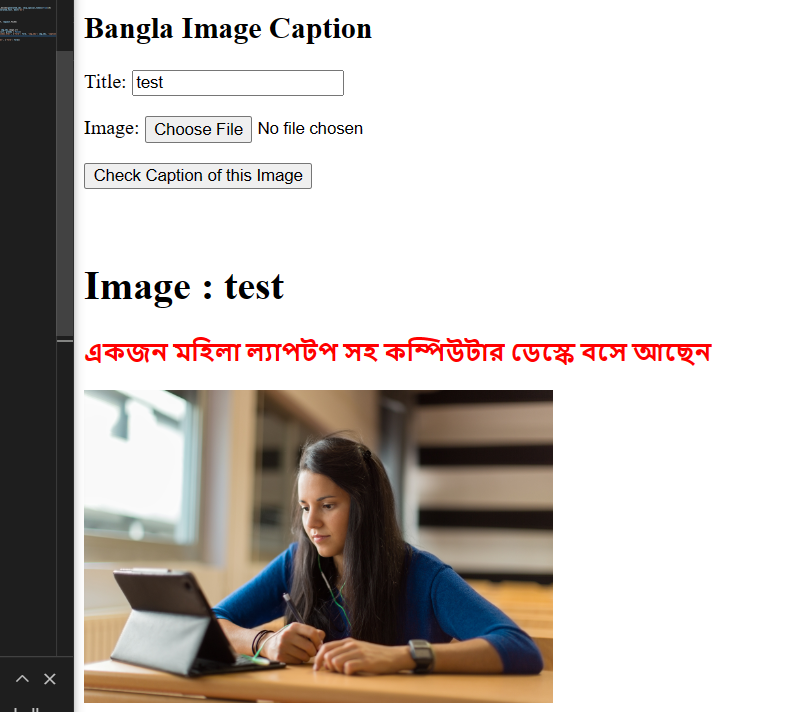
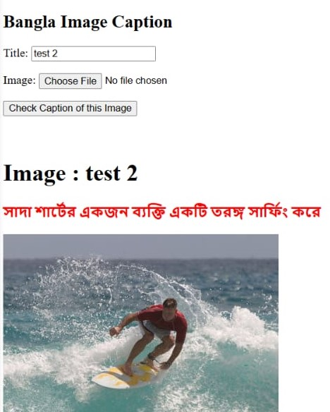

# Bangla Image Captioning
### Bangla Image Captioning WebApp using [NIC-Pretrained Model](https://michael-franke.github.io/npNLG/08-grounded-LMs/08c-NIC-pretrained.html) and [Django Framework](https://docs.djangoproject.com/en/).

 

